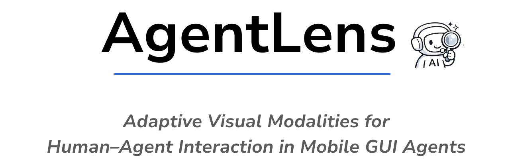
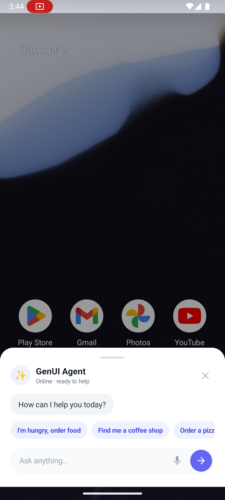

<p align="center">
  
</p>

**AgentLens** is a mobile GUI agent that operates Android apps in the background on your behalf — and adaptively shows you what matters through non-invasive overlay popups, only when your input or attention is needed.

Existing mobile agents either take over your screen (foreground) or run invisibly with no visual feedback (background). AgentLens bridges this gap by running apps on an invisible **Virtual Display** and surfacing just-in-time visual overlays at decision-critical moments, using three adaptive modalities:

- **Full UI** — mirrors the complete app screen when broad visual context is needed (e.g., verifying a payment checkout)
- **Partial UI** — crops and displays only the task-relevant region of the real app for focused, authentic interaction (e.g., confirming a specific menu item)
- **GenUI** — generates a clean, LLM-crafted interface when the original screen is too dense or cluttered (e.g., summarizing a week's calendar into a card)

The agent decides which modality to use based on the task context — no single visualization fits all situations. All overlays appear non-invasively over whatever you're currently doing (browsing, chatting, etc.), so you never lose your place.

---

## How It Works

```
  Python Backend          WebSocket          Android App
  (standalone_m3a/)  ◄──────────────────►  (AgentLens/)
  • GPT agent via ADB                       • Virtual display
  • Screenshots + UI tree                   • Overlay popups
  • Input injection                         • TTS
```

1. Python backend starts a WebSocket server and waits
2. Android app creates a **virtual display** (invisible to the user), connects, and sends the display ID
3. Backend launches the target app on that display and starts the agent loop
4. Agent takes screenshots + reads UI tree → sends to GPT → executes actions via ADB
5. When the agent speaks or asks something, it sends an overlay command to the Android app
6. The app shows a popup mirroring the relevant part of the virtual display + plays TTS

---

## Prerequisites

| Requirement | Notes |
|---|---|
| Android device or emulator | **Recommended: API 36 (Android 16)** |
| Python **3.10+** | |
| OpenAI API key | Needs access to `gpt-5.4` or newer |
| Android Studio | To build the Android app and create an emulator AVD |
| Google account *(optional)* | Required for Google apps (Calendar, Gmail, etc.). Add via Settings → Accounts → Add account → Google |

---

## Setup

### 1. Clone the repo

```bash
git clone <repository-url>
cd agentlens
```

### 2. Start the emulator

Open Android Studio → Device Manager → create an AVD (API 36 recommended), then launch it:

```bash
~/Android/Sdk/emulator/emulator -avd <avd_name>
```

Verify the device is connected:
```bash
adb devices
```

### 3. Install the Android app

```bash
cd AgentLens
./gradlew installDebug
cd ..
```

### 4. Grant permissions on the device

Open the **AgentLens** app once and follow the prompts:

- **Overlay permission** — Settings > Apps > AgentLens > Display over other apps → Enable
- **Notification permission** — Allow
- **Accessibility Service** — Settings > Accessibility > AgentLens → Enable

### 5. Install Python dependencies

```bash
cd standalone_m3a
pip install -r requirements.txt
```

### 6. Set your OpenAI API key

```bash
export OPENAI_API_KEY=sk-...
# or create standalone_m3a/.env with: OPENAI_API_KEY=sk-...
```

---

## Running

### Start the Python backend

```bash
cd standalone_m3a
python run_agent.py --server
```

The terminal prints:
```
Waiting for Android app to connect on port 8765...
```

You can also specify a goal and target app directly from the command line:
```bash
python run_agent.py --server --goal "<your goal>" --package <android.package.name>
```

> **Tip:** If you omit `--goal` and `--package`, you can submit goals directly from the in-app chat UI instead (see below).

### Connect the Android app

1. Open the **AgentLens** app on the device
2. In the **Control** tab, enter the server URL:
   - **Emulator:** `ws://10.0.2.2:8765` (the default `127.0.0.1` won't work — in the emulator, `127.0.0.1` points to the emulator itself, not your host machine)
   - **Real device (same Wi-Fi):** `ws://<your-computer-ip>:8765`
3. Tap **Start Display** and allow screen capture

Verify the connection on **both sides** before proceeding:
- **App:** The status card shows **"Server: Connected"**
- **Terminal:** You see `Android app connected with display_id=N`

Once connected, press Home — the agent runs in the background.

### Alternative: Use the in-app chat UI

Instead of passing `--goal` on the command line, you can type (or tap a suggestion) directly in the app's chat interface and hit Send. The app forwards your message to the backend as the goal, so the agent starts immediately without restarting the server.



This lets you run multiple tasks in sequence without touching the terminal.

### Watch the agent work

The Python terminal shows each step:
```
Android app connected with display_id=2
Step 1...  Action: open_app
Step 2...  Action: click index 4
Step 3...  Agent speak: Your timer has been set for 1 hour.
```

When the agent needs to communicate, an overlay appears on your phone.

---

## Demo Scenarios

### Scenario 1 — Set a Timer

Type in the chat UI:
> *"Set a timer"*

The agent opens the Clock app and asks you how long. An overlay appears showing the timer input — tap the number pad and press play to start. The agent confirms once the timer is running.

---

### Scenario 2 — View This Month's Calendar

> **Note:** Requires a Google account signed in on the device. On an emulator: Settings → Accounts → Add account → Google.

Type in the chat UI:
> *"Show me this month's calendar"*

The agent opens Google Calendar and shows the monthly view in an overlay so you can see all events at a glance.

---

### Scenario 3 — Summarize This Week's Schedule

> **Note:** Requires a Google account signed in on the device with calendar events.

Type in the chat UI:
> *"Summarize this week's schedule"*

The agent opens Google Calendar, reads the weekly view, and generates a clean summary card showing just your events — no calendar chrome, just the facts.

---

## Using 3rd-Party Apps

Apps like **Uber Eats**, **DoorDash**, and other 3rd-party services are not pre-installed. To use them with AgentLens:

1. Install the app on the device/emulator via Google Play Store
2. Open the app and sign in to your account
3. Then ask the agent to perform tasks on that app (e.g., *"Order coffee on Uber Eats"*)

> **Note:** The agent can operate any installed app — it is not limited to built-in system apps.

---

## Key Flags

| Flag | Default | Description |
|---|---|---|
| `--server` | — | Enable WebSocket server mode (required for Android app) |
| `--goal` | — | What you want the agent to do |
| `--package` | — | Android package to launch on the virtual display |
| `--port` | `8765` | WebSocket port |
| `--model` | `gpt-5.4` | OpenAI model |
| `--max_steps` | `20` | Max steps before giving up |
| `-s` | auto | ADB device serial (if multiple devices connected) |

---

## Troubleshooting

| Problem | Fix |
|---|---|
| *"Server: Disconnected"* in app | Check server is running; emulator uses `ws://10.0.2.2:8765` |
| Overlay doesn't appear | Grant overlay permission in device Settings |
| Agent can't read UI | Enable the AgentLens Accessibility Service |
| No TTS audio | Check device volume; TTS may need to download a language pack on first use |
| App keeps reconnecting | Start the Python server **before** tapping Start Display in the app |

---

## Project Structure

```
agentlensOpen/
├── standalone_m3a/              Python AI agent backend
│   ├── run_agent.py             Entry point
│   ├── requirements.txt
│   └── m3a_agent/
│       ├── agent.py             M3A agent loop (GPT action selection + summarization)
│       ├── server.py            WebSocket server + overlay command dispatch
│       ├── screen_parser.py     Semantic UI group parser (AgentLens-style)
│       ├── infer.py             OpenAI API wrapper (raw HTTP, no SDK)
│       └── env/                 ADB environment (screenshot, UI tree, input)
└── AgentLens/                   Android assistant app
    └── app/src/main/java/com/marvis/agentlens/
        ├── service/             Foreground service + WebSocket client
        ├── overlay/             Overlay popup manager
        ├── tts/                 TTS manager
        └── virtualdisplay/      Virtual display creation
```

---

## Architecture Note — AgentLens UI Grouping

The agent uses a semantic UI parser (`screen_parser.py`) that groups the raw accessibility tree into meaningful UI regions before sending them to the LLM. Instead of seeing 40+ flat leaf nodes, the LLM sees grouped regions like:

```
[2] Timer input area — 00h 00m 00s (0,128)-(1080,1760)
[4] Button 1 — [clickable] (229,572)-(431,774)
[16] Bottom navigation bar — Alarm | Clock | Timer (0,1760)-(1080,1920)
```

This makes `show_element` visualization more precise — when the agent picks a group index, the overlay crops the virtual display to exactly that semantic region.

---

## License

MIT
